# CU-RF08: Notificacion Automatica de Tramites Pendientes

## Diagrama de Caso de Uso Especifico — Aduanas System

> **Vista:** Escenarios (Modelo 4+1) | **Requisito:** CU-RF08 | **Proyecto:** Aduanas System

---

## Actores

| Actor | Tipo | Descripcion |
|-------|------|-------------|
| Turista/Pasajero | Primario / Secundario | Participa en el caso de uso |
| Servicio Email SMTP | Primario / Secundario | Participa en el caso de uso |

---

## Diagrama

```mermaid
flowchart LR
    %% Actores
    Turista[Turista / Pasajero]
    SMTP[Servicio Email SMTP]

    %% Frontera del Sistema
    subgraph Sistema ["Sistema de Notificaciones Automáticas"]
        UC_Com([Completar pre-registro de trámite])
        UC_Ide([Identificar trámites pendientes])
        UC_Con([Consultar trámites en BD del turista])
        UC_GenR([Generar resumen de trámites])
        UC_Apl([Aplicar plantilla de email])
        UC_Env([Enviar email de notificación])
        UC_EnvS([Enviar vía SMTP seguro])
        UC_Rei([Reintentar envío si falla])
        UC_ConF([Confirmar envío de notificación])
        UC_GenRec([Generar recordatorio antes de llegar])
        UC_Reg([Registrar notificación en auditoría])
    end

    %% Relaciones de Actores
    Turista --> UC_Com
    UC_EnvS --> SMTP

    %% Relaciones entre Casos de Uso
    UC_Com -.->|&lt;&lt;include&gt;&gt;| UC_Ide
    UC_Ide -.->|&lt;&lt;include&gt;&gt;| UC_Con
    UC_Ide -.->|&lt;&lt;include&gt;&gt;| UC_GenR
    UC_GenR -.->|&lt;&lt;include&gt;&gt;| UC_Apl
    UC_GenR -.->|&lt;&lt;include&gt;&gt;| UC_Env
    UC_Env -.->|&lt;&lt;include&gt;&gt;| UC_EnvS
    UC_Rei -.->|&lt;&lt;extend&gt;&gt;| UC_EnvS
    UC_Env -.->|&lt;&lt;include&gt;&gt;| UC_ConF
    UC_ConF -.->|&lt;&lt;include&gt;&gt;| UC_Rei
    UC_GenRec -.->|&lt;&lt;extend&gt;&gt;| UC_ConF
    UC_Rei -.->|&lt;&lt;include&gt;&gt;| UC_Reg
```

---

## Relaciones UML

| Tipo | Descripcion |
|------|-------------|
| `<<include>>` | Relacion obligatoria — el caso de uso base siempre ejecuta el incluido |
| `<<extend>>` | Relacion opcional — se ejecuta solo bajo ciertas condiciones |

---

*Documento de Arquitectura de Software (DAS) — Aduanas System v1.0*
*Generado para la carpeta UML-DIA del repositorio PrototipoXD*
