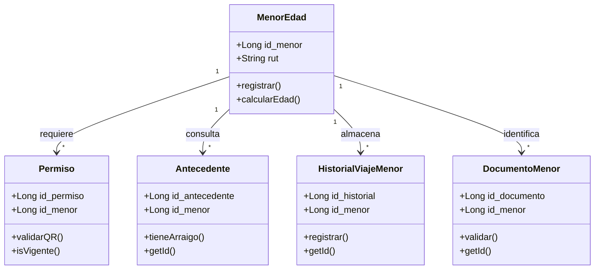

# Diagrama de Clases — MS Menores

> **Vista DAS:** 4.2 Vista Logica | **Proyecto:** Aduanas System

---

## Descripcion

Clases del microservicio Menores: MenorEdad, Permiso, Antecedente, HistorialViajeMenor y DocumentoMenor.

---

## Diagrama

---

| Notacion | Significado |
|----------|-------------|
| `+` | Visibilidad publica |
| `-` | Visibilidad privada |
| `<<enumeration>>` | Enumeracion UML |
| `1 --> *` | Uno a muchos |
| `1 --> 1` | Uno a uno |
| `<|--` | Herencia |
| `<<include>>` | Relacion obligatoria CU |
| `<<extend>>` | Relacion opcional CU |

---

*DAS Aduanas System v1.0 — Dario Rojas / Nicolas Herrera — DuocUC*
