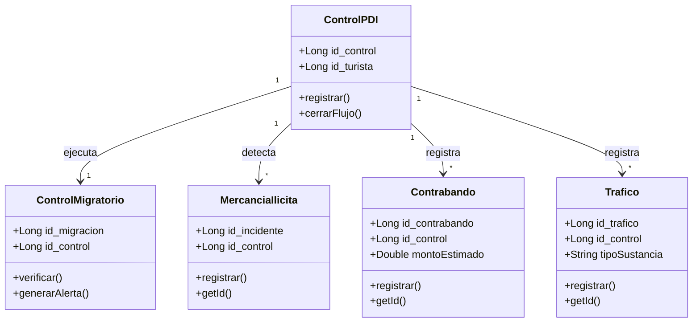

# Diagrama de Clases — MS PDI

> **Vista DAS:** 4.2 Vista Logica | **Proyecto:** Aduanas System

---

## Descripcion

Clases del microservicio PDI: ControlPDI, ControlMigratorio, MercanciaIlicita, Contrabando y Trafico.

> **CORRECCIÓN v1.1:**
> 1. Se corrige el typo de la clase `Mercanciallicita` → **`MercanciaIlicita`**.
> 2. `Contrabando` y `Trafico` dejan de ser subclases (herencia) de `MercanciaIlicita` y pasan a ser **3 asociaciones 1:N independientes desde ControlPDI**, tal como lo describe el texto del DAS ("Tiene relación 1:1 con ControlMigratorio y relaciones 1:N con Contrabando, Trafico y MercanciaIlicita").

---

## Diagrama

---

| Notacion | Significado |
|----------|-------------|
| `+` | Visibilidad publica |
| `-` | Visibilidad privada |
| `<<enumeration>>` | Enumeracion UML |
| `1 --> *` | Uno a muchos |
| `1 --> 1` | Uno a uno |
| `<|--` | Herencia |
| `<<include>>` | Relacion obligatoria CU |
| `<<extend>>` | Relacion opcional CU |

---

*DAS Aduanas System v1.1 — Dario Rojas / Nicolas Herrera — DuocUC*
