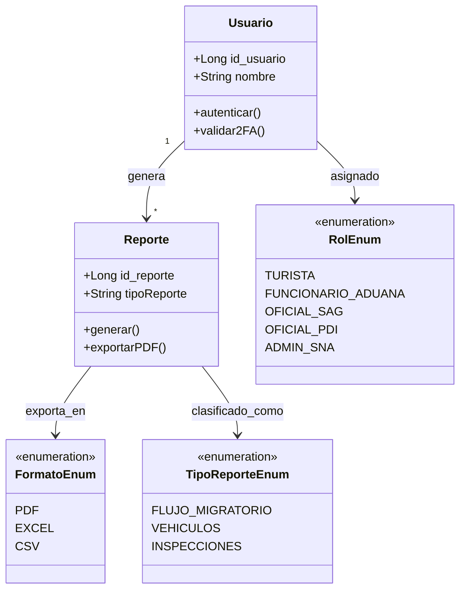

# Diagrama de Clases — MS Reportes y Usuario

> **Vista DAS:** 4.2 Vista Logica | **Proyecto:** Aduanas System

---

## Descripcion

Clases de Usuario y Reporte con enumeraciones RolEnum, FormatoEnum y TipoReporteEnum.

> **CORRECCIÓN v1.1:**
> 1. Se agrega la relación **Usuario "1" --> "*" Reporte** (el texto del DAS la menciona — "Se relaciona 1:N con Reporte" — pero no estaba dibujada en el diagrama original).
> 2. Se corrigen los valores de `RolEnum` para que coincidan con el texto del DAS: `OFICIAL_SAG`, `OFICIAL_PDI`, `ADMIN_SNA` (antes decía `SAG`, `PDI`, `ADMINISTRADOR`).

---

## Diagrama

---

| Notacion | Significado |
|----------|-------------|
| `+` | Visibilidad publica |
| `-` | Visibilidad privada |
| `<<enumeration>>` | Enumeracion UML |
| `1 --> *` | Uno a muchos |
| `1 --> 1` | Uno a uno |
| `<|--` | Herencia |
| `<<include>>` | Relacion obligatoria CU |
| `<<extend>>` | Relacion opcional CU |

---

*DAS Aduanas System v1.1 — Dario Rojas / Nicolas Herrera — DuocUC*
