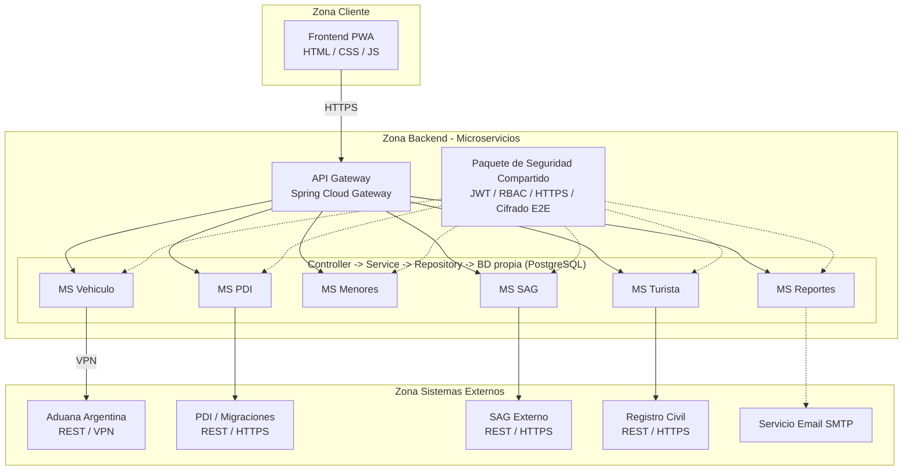

# Diagrama de Componentes — Aduanas System

> **Vista DAS:** 4.3 Vista de Desarrollo | **Proyecto:** Aduanas System

---

## Descripcion

Diagrama de componentes organizado en las tres zonas descritas en el DAS: Zona Cliente, Zona Backend (microservicios) y Zona Sistemas Externos.

> **CORRECCIÓN v1.1:** el diagrama anterior usaba **Kong API Gateway**, **Kafka Message Broker**, **MongoDB** (para MS PDI) y **Angular / Flutter** en el frontend — ninguna de estas tecnologías está declarada en ningún otro lugar del DAS. Se reemplazan por lo que sí está declarado y justificado: **Spring Cloud Gateway**, **PostgreSQL** (Database-per-Service, uniforme para los 6 microservicios) y **PWA (HTML/CSS/JS)** en el frontend — que además es lo que efectivamente construye el prototipo.

---

## Diagrama

---

| Notacion | Significado |
|----------|-------------|
| `+` | Visibilidad publica |
| `-` | Visibilidad privada |
| `<<enumeration>>` | Enumeracion UML |
| `1 --> *` | Uno a muchos |
| `1 --> 1` | Uno a uno |
| `<|--` | Herencia |
| `<<include>>` | Relacion obligatoria CU |
| `<<extend>>` | Relacion opcional CU |

---

*DAS Aduanas System v1.1 — Dario Rojas / Nicolas Herrera — DuocUC*
