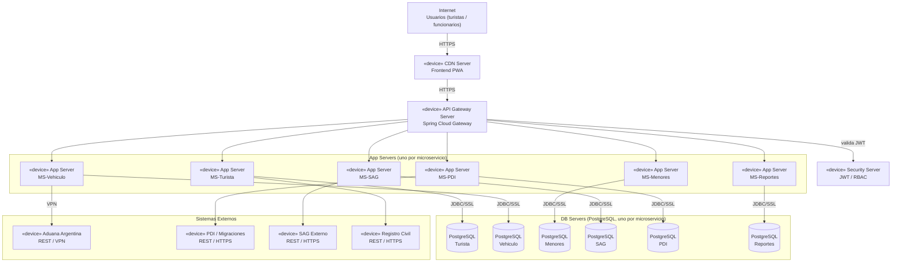

# Diagrama de Despliegue — Aduanas System

> **Vista DAS:** 4.5 Vista Fisica | **Proyecto:** Aduanas System

---

## Descripcion

Infraestructura de despliegue con App Servers y DB Servers independientes por microservicio (Database-per-Service), sin contenedores/orquestador.

> **CORRECCIÓN v1.1:** el diagrama anterior describía un **clúster Kubernetes con pods Docker y Nginx Ingress Controller**, y solo mostraba 3 de los 6 microservicios. Esto no coincide con la Vista Física del DAS, que describe **App Servers independientes (MS1 al MS6)** cada uno con su propia base de datos PostgreSQL. Se corrige para incluir los 6 microservicios y se elimina la referencia a Kubernetes/Docker/Nginx.

---

## Diagrama

---

| Notacion | Significado |
|----------|-------------|
| `+` | Visibilidad publica |
| `-` | Visibilidad privada |
| `<<enumeration>>` | Enumeracion UML |
| `1 --> *` | Uno a muchos |
| `1 --> 1` | Uno a uno |
| `<|--` | Herencia |
| `<<include>>` | Relacion obligatoria CU |
| `<<extend>>` | Relacion opcional CU |

---

*DAS Aduanas System v1.1 — Dario Rojas / Nicolas Herrera — DuocUC*
